# 📚 Taller SQL – Biblioteca

Base de datos: db_library

---

## 🔹 1. SUBCONSULTAS

### 1.1 Usuarios que han reservado libros de la categoría "Fiction"

```sql
SELECT FirstName, LastName
FROM Users
WHERE UserID IN (
    SELECT UserID
    FROM Reservations
    WHERE BookID IN (
        SELECT BookID
        FROM Books
        WHERE CategoryID = (
            SELECT CategoryID
            FROM BookCategories
            WHERE CategoryName = 'Fiction'
        )
    )
);
```
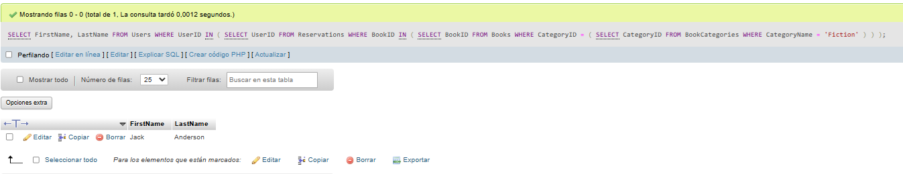

---

### 1.2 Libros que están prestados

```sql
SELECT Title, Author
FROM Books
WHERE BookID IN (
    SELECT BookID FROM Loans
);
```
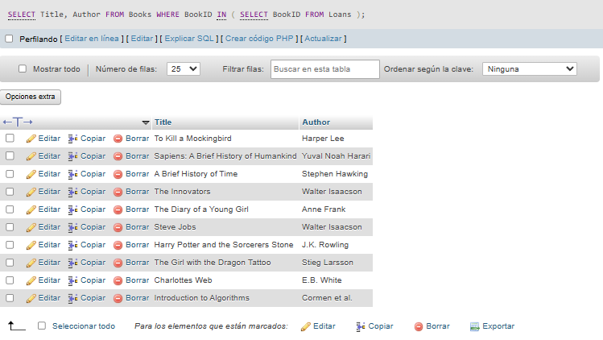

--- 

## 🔹 2. OPERADORES DE CONJUNTO

### 2.1 Libros reservados pero no prestados

```sql
SELECT Title
FROM Books
WHERE BookID IN (SELECT BookID FROM Reservations)
AND BookID NOT IN (SELECT BookID FROM Loans);
```

Sale vacía porque los BookID de ambas tablas (Reservation y Loans) son iguales.

Eso significa que no existe ningún libro que esté prestado y no reservado.

---

### 2.2 Libros prestados pero no reservados
```sql
SELECT Title
FROM Books
WHERE BookID IN (SELECT BookID FROM Loans)
AND BookID NOT IN (SELECT BookID FROM Reservations);
```

Igual que la anterior, pero a la inversa: sale vacía porque los BookID de ambas tablas (Reservation y Loans) son iguales.

Eso significa que no existe ningún libro que esté reservado y no prestado.

---

## 🔹 3. EXPRESIONES CONDICIONALES

### 3.1 Estado de los libros
```sql
SELECT Title,
       CASE
           WHEN AvailableCopies > 0 THEN 'Disponible'
           ELSE 'Agotado'
       END AS Estado
FROM Books;
```
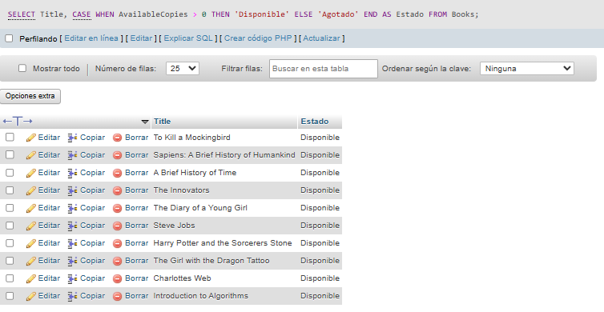

---

### 3.2 Estado de usuarios

```sql
SELECT FirstName, LastName,
       CASE
           WHEN UserID IN (SELECT UserID FROM Loans) THEN 'Activo'
           ELSE 'Sin actividad'
       END AS EstadoUsuario
FROM Users;
```

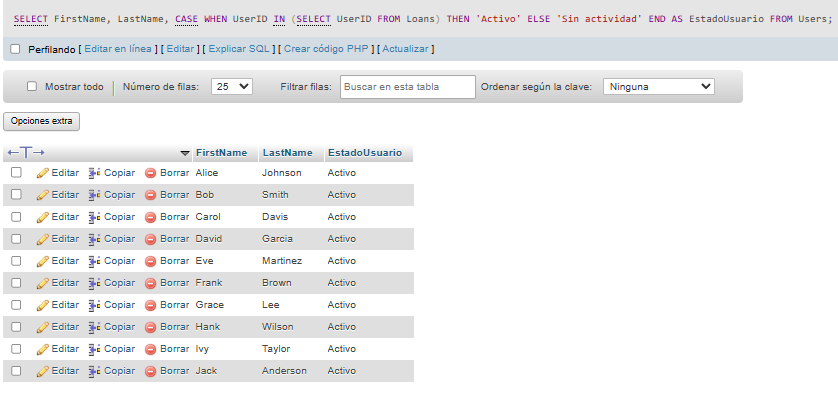

---

## 🔹 4. ANÁLISIS AGREGADO CON GROUP BY Y HAVING

### 4.1 Categorías con más de 3 libros

```sql
SELECT bc.CategoryName, COUNT(b.BookID) AS TotalLibros
FROM BookCategories bc
INNER JOIN Books b ON bc.CategoryID = b.CategoryID
GROUP BY bc.CategoryID, bc.CategoryName
HAVING COUNT(b.BookID) > 3;
```
Sale vacía porque se validó que cada categoría tiene solo 1 libro.

Entonces ninguna cumple 
```sql
COUNT(b.BookID) > 3.
```

---

### 4.2 Usuarios con más de 2 reservas

```sql
SELECT u.FirstName, u.LastName, COUNT(r.ReservationID) AS TotalReservas
FROM Users u
INNER JOIN Reservations r ON u.UserID = r.UserID
GROUP BY u.UserID, u.FirstName, u.LastName
HAVING COUNT(r.ReservationID) > 2;
```

Sale vacía porque cada usuario tiene solo 1 reserva.

Entonces nadie cumple
```sql 
COUNT(r.ReservationID) > 2. 
```

---


## 🔹 5. INNER JOIN

### 5.1 Usuarios y libros prestados

```sql
SELECT u.FirstName, u.LastName, b.Title
FROM Users u
INNER JOIN Loans l ON u.UserID = l.UserID
INNER JOIN Books b ON l.BookID = b.BookID;
```

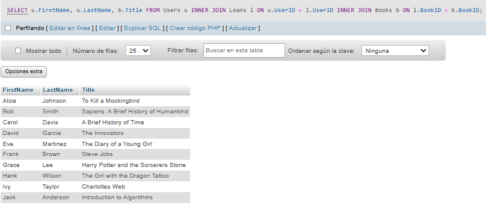

---

### 5.2 Usuarios y libros reservados

```sql
SELECT u.FirstName, u.LastName, b.Title
FROM Users u
INNER JOIN Reservations r ON u.UserID = r.UserID
INNER JOIN Books b ON r.BookID = b.BookID;
```

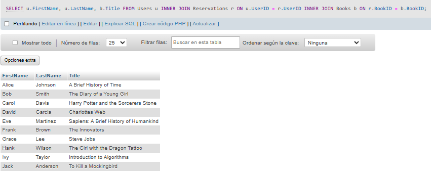

---


## 🔹 6. LEFT JOIN

### 6.1 Libros con usuarios que reservaron

```sql
SELECT b.Title, u.FirstName, u.LastName
FROM Books b
LEFT JOIN Reservations r ON b.BookID = r.BookID
LEFT JOIN Users u ON r.UserID = u.UserID;
```

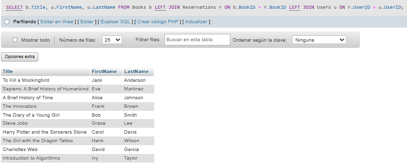

---

### 6.2 Usuarios con libros prestados

```sql
SELECT u.FirstName, u.LastName, b.Title
FROM Users u
LEFT JOIN Loans l ON u.UserID = l.UserID
LEFT JOIN Books b ON l.BookID = b.BookID;
```

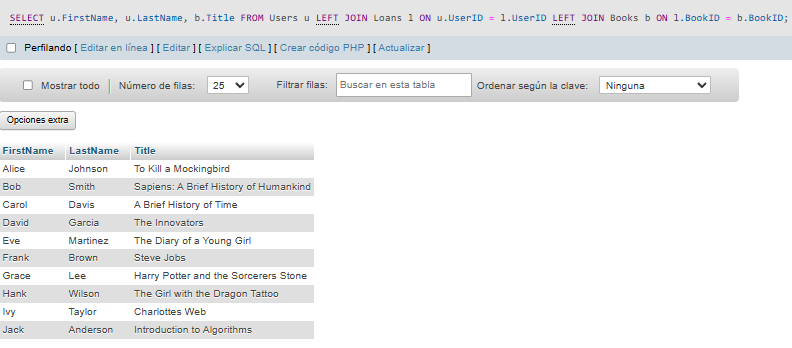

---


## 🔹 7. RIGHT JOIN

### 7.1 Libros con reservas

```sql
SELECT b.Title, u.FirstName, u.LastName
FROM Reservations r
RIGHT JOIN Books b ON r.BookID = b.BookID
LEFT JOIN Users u ON r.UserID = u.UserID;
```

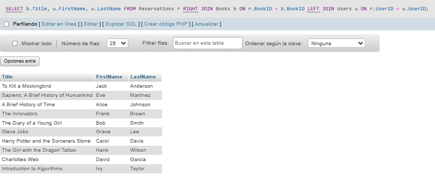

---

### 7.2 Usuarios con préstamos

```sql
SELECT u.FirstName, u.LastName, b.Title
FROM Loans l
RIGHT JOIN Users u ON l.UserID = u.UserID
LEFT JOIN Books b ON l.BookID = b.BookID;
```

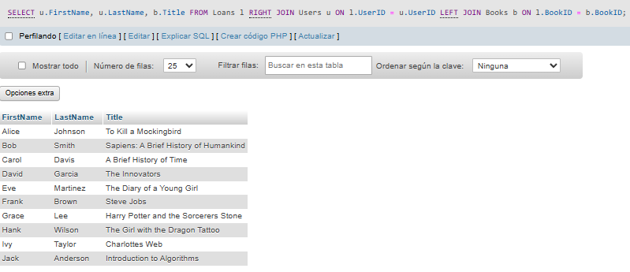

---

## 🔹 8. FUNCIONES ESPECIALIZADAS

### 8.1 Títulos en mayúsculas

```sql
SELECT UPPER(Title) FROM Books;
```

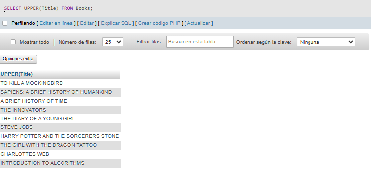

---

### 8.2 Nombre completo

```sql
SELECT CONCAT(FirstName, ' ', LastName) FROM Users;
```

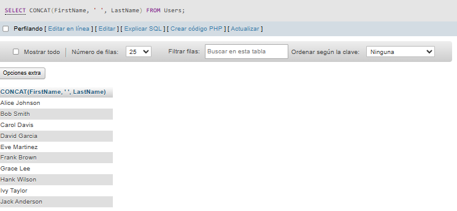

---

## 🔹 9. FUNCIONES DE FECHA

### 9.1 Días desde la reserva

```sql
SELECT ReservationID,
       DATEDIFF(CURDATE(), ReservationDate)
FROM Reservations;
```

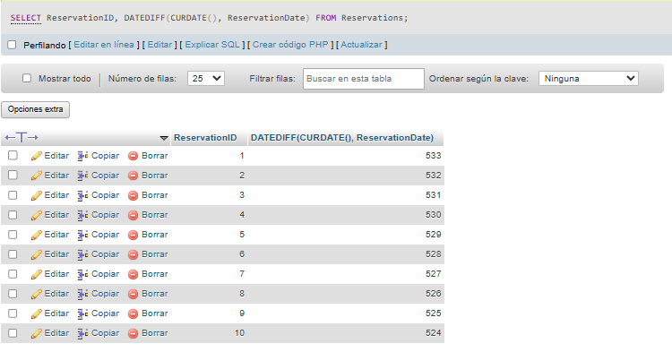

---

### 9.2 Préstamos pendientes

```sql
SELECT * FROM Loans
WHERE ReturnDate IS NULL;
```

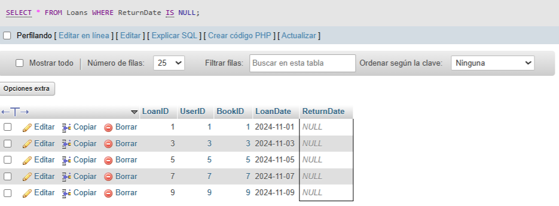

---

## 🔹 10. FUNCIONES DE AGREGACIÓN

### 10.1 Copias por categoría

```sql
SELECT bc.CategoryName, SUM(b.AvailableCopies)
FROM BookCategories bc
JOIN Books b ON bc.CategoryID = b.CategoryID
GROUP BY bc.CategoryName;
```

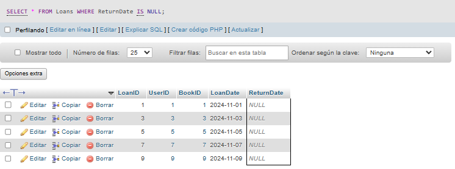

---

### 10.2 Préstamos por usuario

```sql
SELECT u.FirstName, u.LastName, COUNT(l.LoanID)
FROM Users u
LEFT JOIN Loans l ON u.UserID = l.UserID
GROUP BY u.UserID;
```

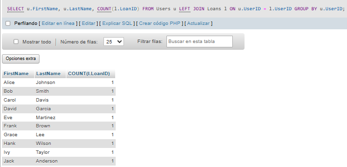

---


